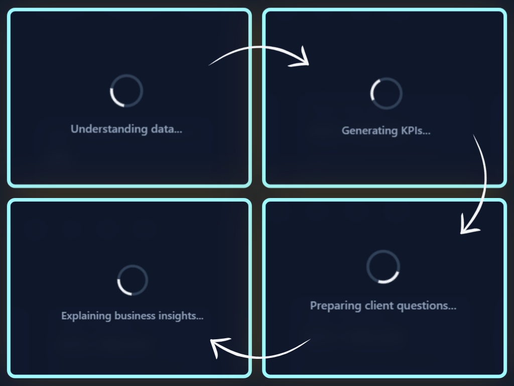

# Keyrus Dataset Analyzer

A React/Tailwind web app for consultant-first data assessment.

## Summary

This project helps consultants quickly profile and assess raw customer datasets (orders, transactions, etc.) and produce a business-friendly assessment: a data dictionary, data-quality checks, KPIs, insights, and recommended questions for the client.

The app runs entirely in the browser with no backend: client-side parsing and transformation (Arquero), plus LLM-driven narrative generation for human-friendly output.

## Requirements

- **Node.js** `^20.19.0` or `>=22.12.0` (required by Vite 8; matches the `engines` field Vite itself declares) — any current LTS release satisfies this. **npm** ships with Node, no separate install needed.
- **API keys for the two LLM providers** the app calls directly from the browser (this is a no-backend app — there's nothing else to run or host):
  - A [Mistral API key](https://console.mistral.ai/api-keys) — powers the data dictionary and business insights.
  - A [Google AI Studio (Gemini) API key](https://aistudio.google.com/app/api-keys) — powers the client questions.
- A modern browser — latest Chrome, Firefox, Safari, or Edge.

## Installation

```bash
# 1. Clone the repo and install dependencies
git clone https://github.com/gigalipa/Keyrus-Dataset-Analyzer
cd lakeside-keyrus
npm install

# 2. Configure API keys
cp .env.example .env
# then edit .env and fill in VITE_MISTRAL_API_KEY and VITE_GOOGLE_API_KEY
# with your own keys, and
# / VITE_MISTRAL_MODEL_ID / VITE_MISTRAL_FALLBACK_MODEL_ID /
# VITE_GOOGLE_MODEL_ID / VITE_GOOGLE_FALLBACK_MODEL_ID
# with your chosen model IDs, or leave the predefined ones.
# Keys are read client-side (Vite's VITE_-prefixed env vars).

# 3. Run the dev server
npm run dev
# open the printed local URL (defaults to http://localhost:5173)
```

Other useful commands, once installed:

```bash
npm run build        # type-check (tsc -b) + production build
npm run lint          # eslint
npx tsc -b --noEmit   # type-check only
```

## Quick Tutorial

1. **Upload your dataset** — drag and drop a CSV, TSV, XLS, XLSX, or SQL export onto the upload zone.
   

2. **Wait a few seconds** while the app understands the data, generates KPIs, explains business insights, and prepares client questions.
   

3. **Review the results** — a live dashboard with KPIs, notices, data dictionary, quality checks, business insights, and downloadable Markdown/PDF reports.
   

4. **Upload as many datasets as you need** and revisit any of them from your history panel.
   
## Current Status

- **Planning & process artifacts:**
  - [docs/project-description.md](docs/project-description.md) — the spec and requirements.
  - [docs/development-process.md](docs/development-process.md) — the phased roadmap (11 phases across the MVP and beyond-MVP batches).
  - [docs/orchestration-plan.md](docs/orchestration-plan.md) — the multi-agent execution plan: batching, checkpoints, verification per phase.
  - [.vibe/skills/generate-development-process/](.vibe/skills/generate-development-process/) — skill used to generate the roadmap.
  - [.vibe/skills/orchestrate-development-process/](.vibe/skills/orchestrate-development-process/) — skill for multi-agent execution.
  - [.claude/skills/update-repo/](.claude/skills/update-repo/) — skill that syncs these docs and commits at each milestone/phase checkpoint.
  - [docs/current-status.md](docs/current-status.md) — summarization of the current status of the system.
  - `NOTES.md` — development notes, process guidance, and issues encountered along the way.
  

## Goals

1. ✅ Accept CSV, TSV, XLS, XLSX and SQL files in the browser.
2. ✅ Parse and normalize datasets client-side.
3. ✅ Compute data profiles (nulls, duplicates, inconsistencies, outliers).
4. ✅ Generate a data dictionary and business insights via an LLM.
5. ✅ Present findings in a clear, consultant-facing UI.

Development history:

1. ~~**Phase 1 — Project Foundation & File Upload**~~ ✅ Done — Vite/React/Tailwind scaffold, responsive shell, drag-and-drop upload with validation, CSV/TSV preview.
2. ~~**Phase 2 — Data Ingestion Pipeline**~~ ✅ Done — CSV/TSV, Excel, and SQL parsers, normalized into Arquero tables.
3. ~~**Phase 3 — Data Analysis Engine**~~ ✅ Done — column/type inference, descriptive statistics with outlier detection, data-quality checks, date detection/normalization.
4. ~~**Phase 4 — LLM-Powered Insights**~~ ✅ Done — Mistral + Google AI Studio clients, shared structured-output schema, data dictionary/business insights/client questions all generating and rendering real content.
5. ~~**Phase 5 — Results Presentation & Polish**~~ ✅ Done — real pipeline wired end-to-end, tabbed results UI, loading skeletons, copy-to-clipboard, responsive/keyboard/cross-browser polish, downloadable Markdown report.
6. ~~**Phase 6 — Persistent Storage & Multi-Dataset History**~~ ✅ Done — IndexedDB persistence layer (`src/lib/storage/`), History sidebar with dataset switching and delete, and a conditional "Upload a dataset" modal that only appears when there's nothing saved yet.
7. ~~**Phase 7 — Application Shell Redesign**~~ ✅ Done — top bar with a conditionally-visible History button, collapsible left sidebar with all 8 destinations, and sidebar-routed center viewport that replaces Phase 5's scroll-spy tab bar entirely.
8. ~~**Phase 8 — Automated Sequential LLM Pipeline & Loading Experience**~~ ✅ Done — chained-context LLM calls (verified via real prompt payloads) replacing manual "Generate" buttons, stage-by-stage loading overlay that locks the shell, business-facing KPI cards in the top bar.
9. ~~**Phase 9 — Business-Facing Views**~~ ✅ Done — Dashboard (Recharts, live client-computed KPIs/notices/charts, a real cross-widget filter), Explanation (real prose), filter/sort Business Insights and Questions cards with importance.
10. ~~**Phase 10 — LLM-Informed Cleaning Pipeline & Data Views Rework**~~ ✅ Done — a real "understand → plan cleaning → clean → analyze" stage ahead of EDA (an LLM-authored cleaning plan applied by a deterministic ETL engine), Overview/Data Dictionary now reflecting genuinely cleaned data, a "How issues were managed" audit trail in Quality, and a raw-vs-cleaned Datasets comparison with full CSV downloads.
11. ~~**Phase 11 — PDF Report & Final Polish**~~ ✅ Done — a real, client-presentable multi-page PDF report (jsPDF + html2canvas) covering Dashboard KPIs/charts, Explanation, Business Insights, Questions, and Data Quality, wired to the sidebar's "Download PDF Report" button; cross-cutting re-verification of the new shell (responsive breakpoints, keyboard navigation, cross-browser) found and fixed two real bugs along the way (a missing Escape-to-close on the mobile nav overlay, and a mitigated intermittent WebKit file-read error).

Full task-level detail lives in [docs/development-process.md](docs/development-process.md); the execution/batching plan is in [docs/orchestration-plan.md](docs/orchestration-plan.md).

## Development time use

Time actually spent, derived from `git log` timestamps, plus the untracked planning/setup work that preceded the first commit. The MVP (Phases 1–5) landed same-day, 2026-08-08; the beyond-MVP batch (Phases 6–11) ran 2026-08-09.

### MVP (Phases 1–5)
| Stage | Span | Duration |
|---|---|---|
| Planning & tool readiness *(MCPs, CLI, Skills, GitHub repo setup — not captured in commit history)* | before 09:42 | ~2h 00m |
| Init commit → Phase 1 (upload UI + preview) | 09:42 → 10:07 | 24m |
| Phase 2 (multi-format parsers + Arquero integration) | 10:07 → 10:51 | 44m |
| README sync (Phase 1–2) | 10:51 → 10:54 | 3m |
| `.claude/` tooling sync + orchestration skill | 10:54 → 11:17 | 23m |
| Phase 3 (data analysis engine) | 11:17 → 11:57 | 40m |
| Phase 4 (LLM-powered insights) | 11:57 → 13:21 | 1h 24m |
| Phase 5 (full wiring, provider swap, rename, final code review + bug fixes) | 13:21 → 16:34 | 3h 13m |
| AFK Time for lunch and other personal affairs | 12:00 → 13:00 / 14:00 → 16:00 | 3h |
| **Total, planning through MVP close-out** | 09:42 → 16:34 (+2h pre-work - 3h AFK) | **~5h 52m** |

### Phases 6–11 (beyond-MVP batch)
| Stage | Span | Duration |
|---|---|---|
| Phase 6 — Persistent Storage & Multi-Dataset History | 05:10 → 05:34 | 23m |
| Phase 7 — Application Shell Redesign | 05:34 → 07:38 | 1h 04m |
| AFK time for yoga | 6:30 → 7:30 | 1h |
| Phase 8 — Automated Sequential LLM Pipeline & Loading Experience | 07:38 → 09:07 | 1h 29m |
| AFK time for breakfast | 8:00 → 9:00 | 1h |
| Phases 9–10 — Business-Facing Views & LLM-Informed Cleaning/Data Views Rework *(one combined commit — see `docs/orchestration-plan.md` for why)* | 11:07 → 20:02 | 8h 55m |
| AFK time for lunch and personal affairs | 12:00 → 17:00 | 5h |
| Phase 11 — PDF Report & Final Polish | 20:02 → 22:11 | 2h 09m |
| AFK time for dinner & family time | 20:30 → 22:00 | 1h 30m |
| README sync (Requirements/Installation) | 22:11 → 22:19 | 8m |
| **Total, Phases 6–11** | 05:10 → 22:19 (-8h 30m AFK) | **5h 39m** |

**Grand total (planning → Phases 1–11 complete): ~12h.**

## Future work

The 11-phase roadmap defined by `docs/project-description.md`/`docs/beyond-MVP.md` is complete — there's no remaining scope from the spec itself. What's left from here is narrower: testing, adjusting, and optimizing the LLM-generated content the app already produces, not new features.

- **Periodic manual QA against varied real-world datasets** (retail, tourism, healthcare, logistics, etc.), not just the fixture dataset. This is exactly how the "Total age" KPI bug got caught — a dataset from a domain the app hadn't been tried on yet surfaced a metric that was schema-valid but business-nonsensical. Domain-mismatch issues like that one tend to only show up with a genuinely different dataset shape.
- **Track model/version currency.** `.env.example` pins specific Mistral/Gemini model IDs that will age as both providers ship newer versions — periodically re-verify the configured primary/fallback pair still exists and re-check output quality after any change, since a model swap can shift both structured-output reliability and the kind of judgment calls (like the age-summing one) the prompts now rely on the model to make correctly.
- **Compare the two providers on domain-sensitive tasks.** Data dictionary/business insights run on Mistral, client questions on Gemini — worth occasionally checking whether both follow the "reason about the dataset's business domain first" instruction equally well, since prompt-following quality can differ between providers even with identical wording.
- **Multi-language LLM output**, if it ever becomes relevant — already flagged in the original roadmap as a deferred, revisit-when-needed item ("if international clients are targeted"). Since every user-facing string this app generates is prompt-driven, this would stay a small, contained prompt change (a language parameter in the system prompt), not an architectural one.

## How to Contribute

- Open an issue describing the feature or bug.
- Start a branch named `feat/<short-name>` or `fix/<short-name>`.
- Keep changes focused and small; prefer small PRs with a single goal.

## License

CC-BY-4.0

**Developed by:** Daniel Peraza
**Co-Authors:** Mistral Vibe & Claude Code
